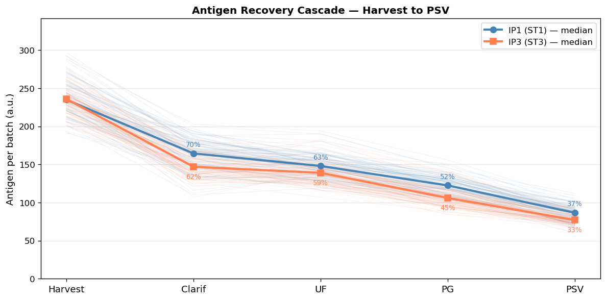
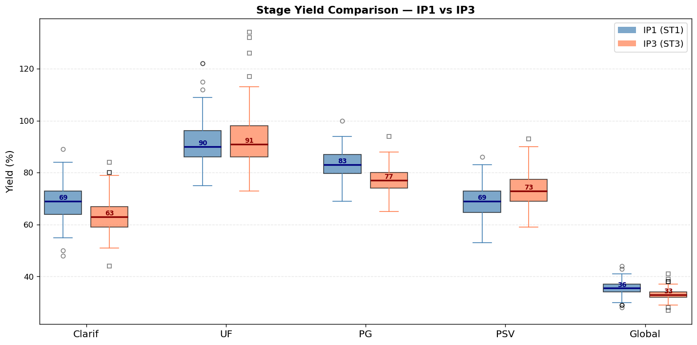
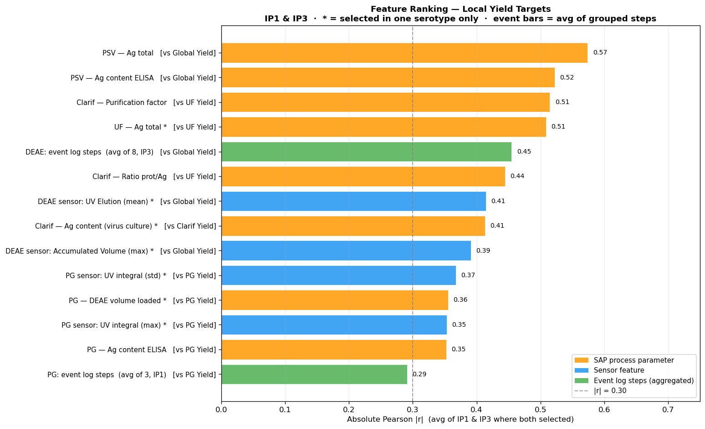
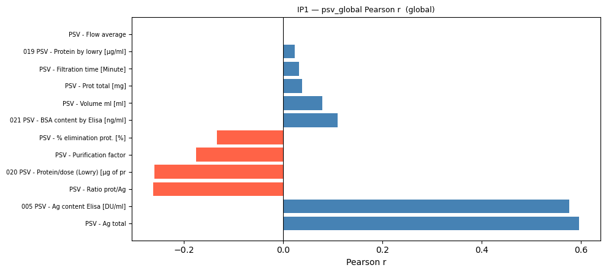

# GSK × IÉSEG Hackathon — AI Yield Prediction for Polio Vaccine Purification

**Title:** New AI methodologies to analyze the production process and improve yield  
**Partner:** GSK Vaccines

---

## Problem Statement

Only ~34% of harvested antigen from the polio vaccine (IPV) purification process reaches final product. Yield varies by several percentage points between batches, and each 1% improvement translates to roughly 16,000 additional doses. This project applies AI and data analytics to move from reactive monitoring to predictive modeling of batch yield across the full purification pipeline.

---

## Core Questions

This project is structured around three questions that GSK needs answered before acting on any model output:

> **Q1 — Can you trust the solution?**
> How was the data set up? Is the experimental design sound enough to draw conclusions from?

> **Q2 — Can we predict yield or not?**
> Do the models capture enough signal to be useful, or is yield variation essentially unpredictable?

> **Q3 — What parameters can GSK change?**
> Which process conditions actually drive yield, and what concrete actions should operators take?

Answers to all three are in the [Results](#results) section below.



*Antigen recovery drops progressively at each purification stage. By PSV, only 33–37% of harvested antigen remains — consistent across both serotypes (IP1 and IP3).*

---

## Purification Stages

```
Clarification → Ultrafiltration (UF) → Gel Filtration (PG) → Ion Exchange (DEAE) → PSV → DPV
```

**Target variable:** `GY_011 PSV - Global Yield total [%]` — the percentage of antigen that reaches the PSV stage across the full pipeline.



*Yield distributions per stage for IP1 (ST1) and IP3 (ST3). UF is the most efficient step (median ~90%). Clarification and Global Yield show the highest batch-to-batch variability and the largest gap between serotypes.*

---

## Repository Structure

```
gsk_github/
├── notebooks/
│   ├── 01_processing/          ← Time-series merging: sensor + events → basetable v5
│   ├── 02_feature_selection/   ← Pearson + AUC feature selection (local and global)
│   ├── 03_visualization/       ← Descriptive analysis and PCA visualization
│   └── 04_modeling/            ← Stage-by-stage regression models (OLS, RF, HGB)
│
├── dashboard/
│   ├── app_final_yield.py      ← Streamlit prediction app (run with: streamlit run dashboard/app_final_yield.py)
│   ├── test_app.py
│   └── assets/                 ← Logos and static chart images
│
├── data/
│   └── basetable/              ← Merged + imputed + PCA-reduced basetables (Parquet)
│       ├── ip1_basetable_v5.parquet   (88 batches × 864 features)
│       ├── ip2_basetable_v5.parquet   (30 batches × 845 features)
│       └── ip3_basetable_v5.parquet   (87 batches × 861 features)
│
├── models/                     ← Trained stage models per serotype (.pkl)
│
├── outputs/
│   ├── descriptive_analysis/   ← EDA charts (yield distributions, scatter, PCA)
│   └── feature_selection/      ← Pearson score CSVs + per-stage feature ranking charts
│
└── docs/
    ├── Time_Series_Merging_v5_Documentation.md   ← Full pipeline documentation
    ├── GSK_QA_RULES.md                           ← Data quality rules
    ├── PROCESS_CONTEXT.md                        ← Process domain context
    ├── IP1_Dictionary_Final.xlsx                 ← Feature dictionary for Serotype 1
    ├── IP3_Dictionary_Final.xlsx                 ← Feature dictionary for Serotype 3
    ├── Implementation_Guide.xlsx                 ← How to use this repository
    └── Hackathon-Slides_2026.pdf                 ← Final presentation slides
```

---

## Methodology

### 1. Data Sources
- **SAP ZQM105** (3 files: IP1, IP2, IP3) — process parameters and QC measurements for 207 batches across 6 purification stages
- **XTO Sensor data** — ~44 million chromatography sensor readings (10-second frequency) from 7 controller units
- **Events logs** — 7 files recording process step timestamps (start/end per batch per sub-step)

### 2. Basetable Construction (v5 Pipeline)
The basetable creation pipeline is fully documented in `docs/Time_Series_Merging_v5_Documentation.md`. Key steps:

| Step | Output |
|------|--------|
| Events cleaning + duration features | 25 phase-level duration features per batch |
| Child sub-event duration pivoting | 349 sub-step duration features |
| Sub-event time window extraction | 82 qualifying sub-step types (45 PG + 37 DEAE) |
| Full-run sensor aggregation (DuckDB range join) | 264 full-run + 264 elution sensor features |
| Sub-event sensor extraction | 7,216 sub-event sensor features |
| Merge all feature blocks | 206 batches × 8,121 columns |
| SAP join + type-aware imputation | Per-serotype basetables |
| PCA reduction of sub-event sensor block | PG: 3,432 cols → 5 PCs (77.5% var); DEAE: 2,376 cols → 5 PCs (63.0% var) |
| **Final basetables** | IP1: 88×864, IP2: 30×845, IP3: 87×861 |

### 3. Feature Selection
Pearson correlation + AUC-based selection applied per stage (local target) and globally (PSV Global Yield target). Top cross-serotype signals:
- **PSV Ag total** (r ≈ 0.55–0.60) — strongest single predictor
- **Clarification Purification Factor** (r ≈ 0.48–0.55) — earliest upstream signal
- **PG Ag content ELISA** (r ≈ 0.32–0.39) — gel filtration quality
- **DEAE sensor signals** (UV Elution, PIC_I1, Accumulated Volume)



*Top 14 features by absolute Pearson |r| averaged across IP1 and IP3. Orange = SAP process parameters, Blue = chromatography sensor features, Green = event log aggregates. Features marked \* were selected in one serotype only.*



*Per-feature Pearson r against Global Yield for IP1. PSV Ag total (r = 0.60) and PSV Ag content ELISA (r = 0.58) are the dominant positive predictors. PSV Ratio prot/Ag and Purification factor are negatively correlated, reflecting the trade-off between protein removal and antigen retention.*

### 4. Modeling
Stage-by-stage regression for each serotype (IP1, IP3). Three model families evaluated:

| Model | Notes |
|-------|-------|
| Linear Regression (OLS) | Baseline |
| Random Forest | Non-linear, handles mixed features |
| Histogram Gradient Boosting (HGB) | Best overall performance |

**Evaluation:** NRMSE (primary), RMSE, R² on chronological 80/20 hold-out split (no random shuffle).

**Best results (Global Yield — HGB):**

| Serotype | NRMSE | RMSE | R² |
|----------|-------|------|----|
| IP1 (ST1) | 0.042 | 1.49% | **0.778** |
| IP3 (ST3) | 0.042 | 1.40% | **0.664** |

The HGB model explains 78% of yield variance for IP1 and 66% for IP3, with a prediction error of ~1.5 percentage points — within the operational tolerance range for process decisions.

---

## Results

### Q1 — Can you trust the solution?

The experimental design was built to avoid the three most common failure modes in industrial ML: data leakage, serotype cross-contamination, and imputation bias.

| Design Choice | How it was handled |
|---|---|
| **Train / test split** | Chronological 80/20 — earlier batches train, most recent batches test. No random shuffling. |
| **Leakage prevention** | Strict 1-day gap between training and test periods. No future information used. |
| **Serotype isolation** | IP1, IP2, IP3 modeled independently. PCA and scalers fit on IP1 only, then applied to IP2/IP3 — no cross-serotype data bleed. |
| **Missing data** | Type-aware imputation: column-mean for sensor data (with imputation flag), zero-fill for event durations (step didn't run = 0 hours), zero-fill for elution phases (no peak = 0 absorbance). |
| **Feature selection** | Two independent methods (Pearson + AUC) applied separately per stage. Only features selected by both methods in the same serotype qualify as consensus signals. |
| **Dimensionality** | Sub-event sensor block (3,432–6,238 columns) reduced to 10 PCs before modeling to prevent overfitting on small batch counts (88 / 87 rows). |
| **Data scale** | 207 batches total; ~166 used for training, ~41 for testing across IP1 and IP3. |

**Conclusion:** The setup is defensible. The chronological split is the correct choice for batch manufacturing data, and the separation of serotypes prevents inflating apparent predictive power.

---

### Q2 — Can we predict yield or not?

**Yes — for Global Yield. Partially — for intermediate stages.**

Global Yield (the primary target) is well-predicted by HGB across both serotypes:

| Stage | IP1 R² (HGB) | IP3 R² (HGB) | IP1 RMSE | IP3 RMSE |
|-------|-------------|-------------|----------|----------|
| Clarification | 0.021 | 0.151 | 6.76% | 6.53% |
| Ultrafiltration | 0.088 | 0.244 | 9.03% | 9.82% |
| PG | 0.177 | 0.176 | 5.36% | 4.81% |
| PSV | 0.470 | 0.055 | 5.07% | 6.48% |
| **Global Yield** | **0.778** | **0.664** | **1.49%** | **1.40%** |

Intermediate stages (Clarification, UF) are harder to predict because their yield variation is dominated by upstream biological variability that is not fully captured in the SAP data. Global Yield is more predictable because it integrates signals across all stages — late-stage measurements (PSV Ag total, ELISA content) act as strong summary statistics of the full purification run.

**Practical interpretation:** A prediction error of ~1.5 percentage points on Global Yield means the model can reliably distinguish a good batch (>37%) from a poor batch (<30%) — which is the decision that matters operationally.

---

### Q3 — What parameters can GSK change?


*Top 14 features by absolute Pearson |r| averaged across IP1 and IP3.*

Features are grouped into three categories: **upstream signals** (observable before the run is complete), **in-process sensor signals** (real-time monitoring), and **output measurements** (observable only at end of stage).

| Feature | Pearson \|r\| | Type | Stage | Actionable? |
|---------|--------------|------|-------|-------------|
| PSV — Ag total | 0.57 | Output measurement | PSV | No — end-of-run result |
| PSV — Ag content ELISA | 0.52 | Output measurement | PSV | No — end-of-run result |
| Clarif — Purification Factor | 0.51 | Process parameter | Clarification | **Yes** |
| UF — Ag total | 0.51 | Output measurement | UF | No — end-of-run result |
| DEAE: event log steps (avg) | 0.45 | Process timing | DEAE | **Yes** |
| Clarif — Ratio prot/Ag | 0.44 | Process parameter | Clarification | **Yes** |
| DEAE sensor: UV Elution (mean) | 0.41 | Sensor signal | DEAE | **Yes** |
| Clarif — Ag content ELISA | 0.41 | Input quality | Clarification | Partially |
| DEAE sensor: Accumulated Volume | 0.39 | Sensor signal | DEAE | **Yes** |
| PG sensor: UV integral (std) | 0.37 | Sensor signal | PG | **Yes** |
| PG — DEAE volume loaded | 0.36 | Process parameter | PG→DEAE | **Yes** |
| PG sensor: UV integral (max) | 0.35 | Sensor signal | PG | **Yes** |
| PG — Ag content ELISA | 0.35 | Process parameter | PG | **Yes** |

**Concrete recommendations for GSK:**

1. **Monitor Clarification Purification Factor as an early warning signal.**
   It is the strongest upstream predictor (r ≈ 0.51) observable before PG and DEAE run. Batches with low Purification Factor at Clarification are at elevated risk of low Global Yield. A threshold alert could trigger earlier intervention.

2. **Standardize DEAE step timing.**
   DEAE event log aggregates (average of 8 sub-steps, r = 0.45 in IP3) show that how long the DEAE process takes at each sub-step correlates with final yield. Review whether operator-driven timing variation in DEAE loading and equilibration can be tightened.

3. **Use DEAE UV Elution signal as a real-time quality indicator.**
   The UV absorption during the DEAE elution phase (r = 0.41) reflects how cleanly the antigen is being separated from contaminants. Consistently monitoring peak shape and integrated area can flag separation quality in real time, before the batch reaches PSV.

4. **Control PG loaded volume into DEAE.**
   The volume transferred from PG to DEAE (r = 0.36) affects the gel load ratio at DEAE. Operating closer to the optimum load (avoiding both under- and over-loading) is associated with better downstream yield.

5. **Track PG UV integral variability (std) as a column health signal.**
   High standard deviation in the PG UV integral (r = 0.37) indicates inconsistent separation during gel filtration — possibly due to column degradation or packing quality issues. This is an early signal that the PG step is not performing optimally.

---

## How to Run

### Setup

```bash
pip install -r requirements.txt
```

### Streamlit Dashboard

```bash
streamlit run dashboard/app_final_yield.py
```

The dashboard provides:
- **What-if simulation:** Select a batch, edit process feature values, predict yield
- **Model comparison:** NRMSE / RMSE / R² across all stages and models
- **Stage coverage:** Clarification, UF, PG, PSV, and Global Yield for IP1 and IP3

### Notebooks

Run in order:
1. `notebooks/01_processing/Time_Series_Merging.ipynb` — builds the v5 basetables
2. `notebooks/02_feature_selection/` — Pearson + AUC feature selection
3. `notebooks/03_visualization/` — EDA and PCA plots
4. `notebooks/04_modeling/Modeling.ipynb` — trains and evaluates all models

> **Note:** The raw sensor data (~44M rows) is not included in this repository due to file size. The processed basetables in `data/basetable/` are sufficient to run the feature selection, modeling, and dashboard notebooks directly.

---

## Requirements

See `requirements.txt`. Core dependencies:
- `pandas`, `numpy`, `scikit-learn`, `xgboost`
- `streamlit` (dashboard)
- `joblib` (model serialization)
- `duckdb` (sensor range joins in processing notebook)
- `pyarrow` (Parquet I/O)
- `matplotlib`, `seaborn`, `plotly` (visualization)
